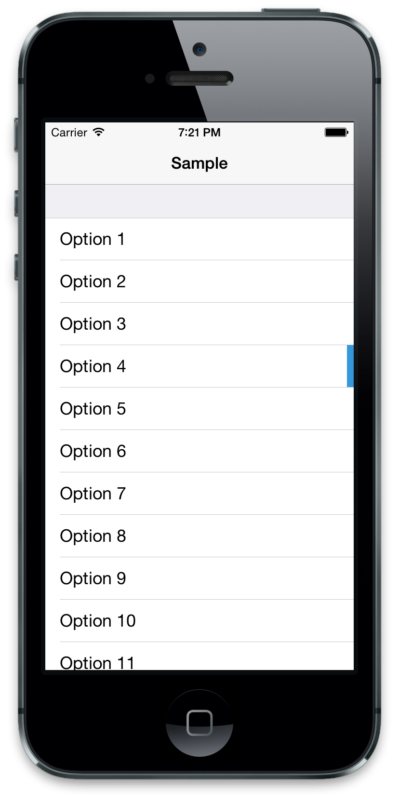

JDFActiveHighlightCell
======================

JDFActiveHighlightCell is a UITableViewCell subclass that enables showing a simple permanent highlight.

Simply use it in place of UITableViewCell, or you can create your own subclass of it.

Call `[cell showActiveHighlight]` on any cell you want to show the highlight on, and `[cell showActiveHighlight]` when you want to hide it.

The look of the highlight can be seen in the screenshot below. The highlight is animated when it is first shown.

You can change the colour of the highlight by setting the cell's `highlightColor` property. The default colour is the blue shown below.

